# :scissors: Short Transformers

- [Unofficial] Pytorch implementation of layer pruning based on layer importance defined proposed in papers:
    - [ShortGPT: Layers in Large Language Models are More Redundant Than You Expect](https://arxiv.org/pdf/2403.03853)
    - [Weight subcloning: direct initialization of transformers using larger pretrained ones](https://arxiv.org/abs/2312.09299)
    - [The Unreasonable Ineffectiveness of the Deeper Layers](https://arxiv.org/abs/2403.17887)
    - [Your Transformer is Secretly Linear](https://arxiv.org/pdf/2405.12250)

- The repository reproduces and extends original methods by offering more layer pruning criteria.
- See example outputs at the end of this README :rocket: (Can you guess a recipe for `01-ai/Yi-1.5-9B-Chat` frankenmerge?)

<p align="center">
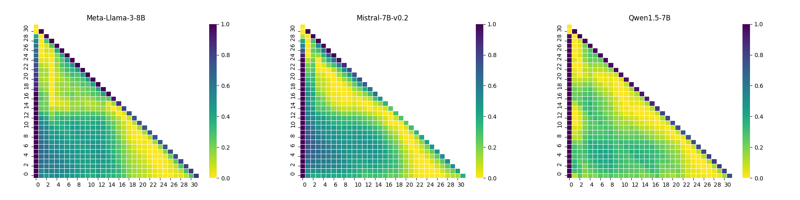
</p>


[](https://pypi.org/project/short-transformers/)
[](https://github.com/astral-sh/ruff)

## Installation:
```sh
pip install short-transformers
```

Required additional dependencies: `torch`, `transformers`, `datasets`, `accelerate`.

## Quickstart:
```python
from short_transformers import ShortTransformer
from datasets import load_dataset

# load from path/hf_hub
model = ShortTransformer.from_pretrained(model_name)

# or use hf model
# model = ShortTransformer.from_model(hf_model)

# load hf dataset
dataset = load_dataset("allenai/c4", "en", split="validation", streaming=True)

# remove 5 layers, use the dataset to find the least important layers to remove
short_model = model.remove_layers(block_size=5, dataset=dataset, limit=1000)

# continue training to heal after the cut
# ...

# save as hf model
short_mdoel.save_pretrained(output_path)
```

Both `short_model` and the saved model are fully compatible with transformers. See `examples/basic.py` for a complete working example.

## Pruning in steps:

Pruning can composed step-by-step and customized:

1. Analyze model layers:
```python
from datasets import load_dataset
from short_transformers import ShortTransformer
from short_transformers.utils import (
    draw_diagram,
    get_scored_blocks,
    get_best_pruning_start,
)
# load from path/hf_hub
model_name = "meta-llama/Meta-Llama-3-8B"

model = ShortTransformer.from_pretrained(model_name, device_map="auto")

dataset = load_dataset("allenai/c4", "en", split="validation", streaming=True)

# calculate distances between inputs/outputs from/to model layers
# results in a triangular numpy array of shape (layer_count, layer_count)
# results[x, y] - averaged distances for block of size x starting at layer y
results = model.analyse_layers(
    dataset=dataset,
    tokenizer=tokenizer,
    use_chat_template=False,
    key="text",
    limit=100,
    max_length=1000,
)

# draw results
# diagrams style matches the style of original article
# "The Unreasonable Ineffectiveness of the Deeper Layers"
draw_diagram(results, "results.png", title="Meta-Llama-3-8B", normalized=True)
```

Example output:
<p align="center">

</p>

2. Find optimal `block_size` and `start_layer`:
```python
# find optimial block of size 'block_size' to prune
start_layer = get_best_pruning_start(results, block_size=5)

# evaluate all possibe block sizes to prune,
# for each block returns score 0-1
# which is averaged over samples distance between input and output to/from a block
block_score = get_scored_blocks(results, return_md=True, threshold=0.3)
```

Example output:

| Block_size | Removed_layers | Score (avg dist)|
| -------- | ------- | -------- |
| 1 | 25-25 | 0.123|
| 2 | 24-25 | 0.155|
| 3 | 25-27 | 0.181|
| 4 | 24-27 | 0.204|
| 5 | 23-27 | 0.226|
| 6 | 22-27 | 0.248|
| 7 | 22-28 | 0.268|
| 8 | 20-27 | 0.291|


3. Pruning layers:

```python
# prune 5-layers block
model.prune(start_layer=start_layer, block_size=5)

# save the pruned model
model.save_pretrained("model_output_dir")
```

See `example/prune_in_steps.py` for a complete working example.

4. Changing the pruning method:

Default pruning method is based on angular distance of the last token.
It is possible to overwrite the distance by using `model.set_metric(some_callable)` before `model.analyse_layers()`.

```python
# ...
from short_transformers.dist import get_angular_distance_ith_token

model_name = "meta-llama/Meta-Llama-3-8B"
model = ShortTransformer.from_pretrained(model_name, device_map="auto")

# choose metric
# calculate distances based on the angular distance of the i=0 token
model.set_metric(get_angular_distance_ith_token(i=0))

# load dataset ...

results = model.analyse_layers(
    dataset=dataset,
    tokenizer=tokenizer,
    key="text",
    limit=1,
    max_length=1000,
)
```

## Supported metric for layer importance calculation:
- bi score (see: [ShortGPT: Layers in Large Language Models are More Redundant Than You Expect](https://arxiv.org/pdf/2403.03853))
- relative magnitude (see: [Weight subcloning: direct initialization of transformers using larger pretrained ones](https://arxiv.org/abs/2312.09299))
- angular distance of the i-th token (see: [The Unreasonable Ineffectiveness of the Deeper Layers](https://arxiv.org/abs/2403.17887))
- averaged angular distances of all tokens
- linear approximation of the i-th token (see: [Your Transformer is Secretly Linear](https://arxiv.org/pdf/2405.12250))
- euclidian dist of the i-th token
   
## Example outputs:

### Meta-Llama-3-8B-Instruct
#### Layerwise distances:

<p align="center">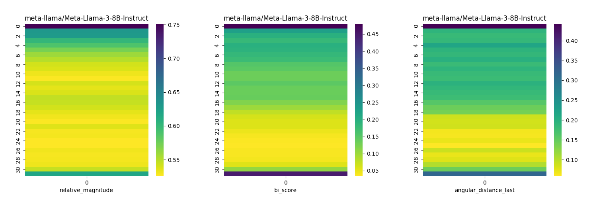</p>

#### Blockwise distances:

#### Euclidian Dist Last Token 

Figure 1: Euclidian Dist Last Token. Figure 2: Euclidian Dist Last Token  Normalised


<p align="center">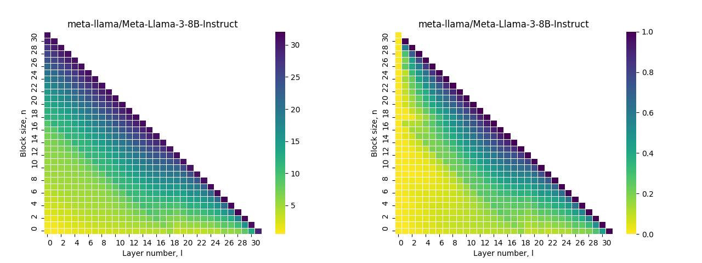</p>

#### Relative Magnitude 

Figure 1: Relative Magnitude. Figure 2: Relative Magnitude  Normalised


<p align="center">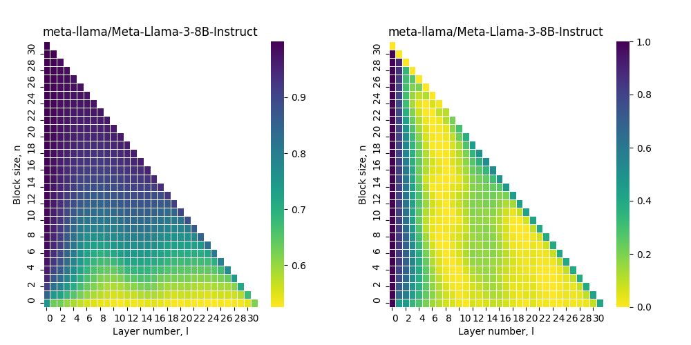</p>

#### Bi Score 

Figure 1: Bi Score. Figure 2: Bi Score  Normalised


<p align="center">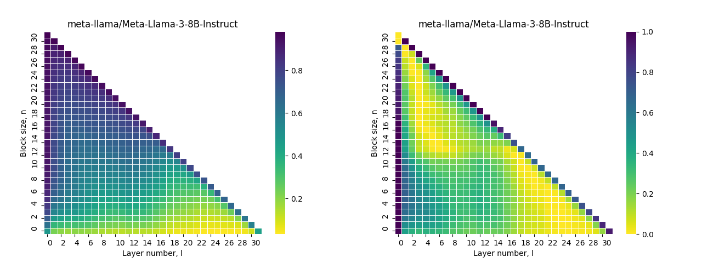</p>

#### Linear Approximation Last Token 

Figure 1: Linear Approximation Last Token. Figure 2: Linear Approximation Last Token  Normalised


<p align="center">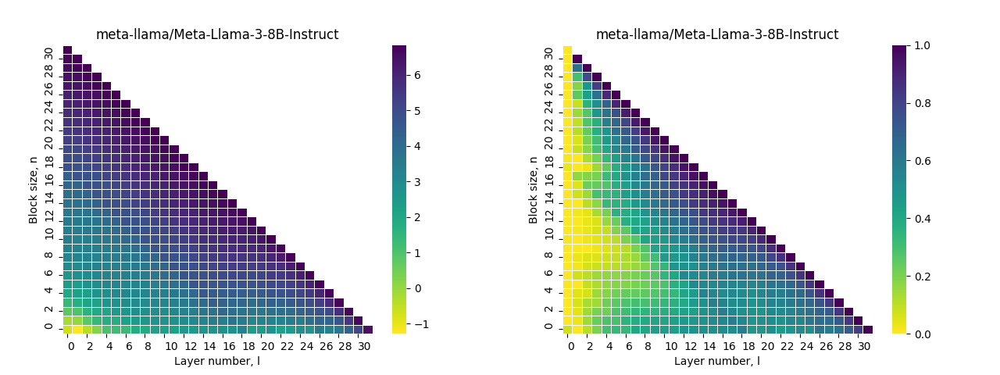</p>

#### Angular Distance All Tokens 

Figure 1: Angular Distance All Tokens. Figure 2: Angular Distance All Tokens  Normalised


<p align="center">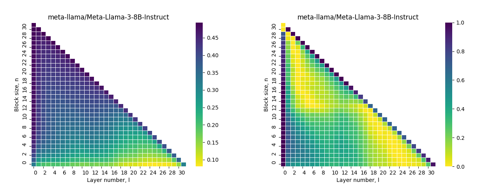</p>

#### Angular Distance Last Token 

Figure 1: Angular Distance Last Token. Figure 2: Angular Distance Last Token  Normalised


<p align="center">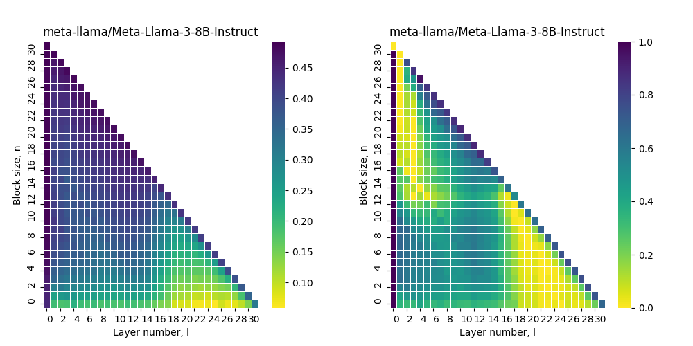</p>


### Yi-1.5-9B-Chat-16K

#### Layerwise distances:


<p align="center">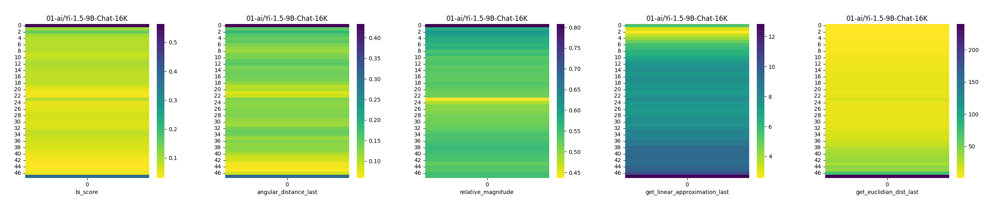</p>

#### Blockwise distances:

#### Euclidian Dist Last Token 

Figure 1: Euclidian Dist Last Token. Figure 2: Euclidian Dist Last Token  Normalised


<p align="center"></p>

#### Relative Magnitude 

Figure 1: Relative Magnitude. Figure 2: Relative Magnitude  Normalised


<p align="center">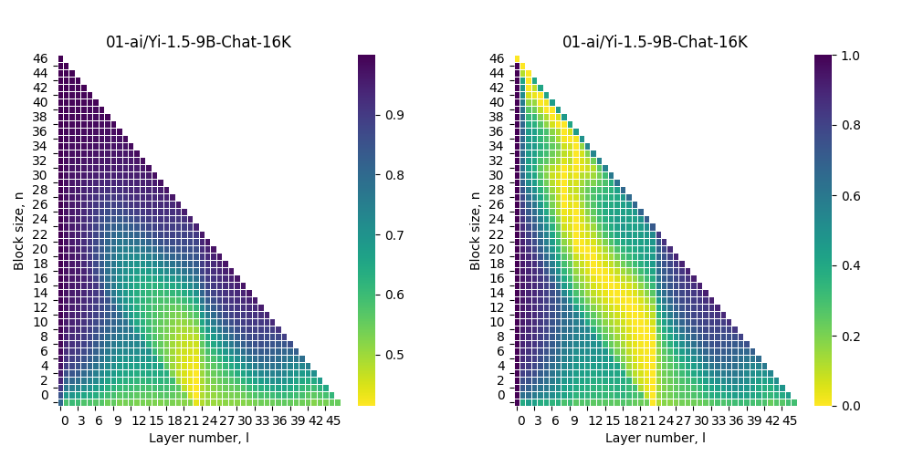</p>

#### Bi Score 

Figure 1: Bi Score. Figure 2: Bi Score  Normalised


<p align="center">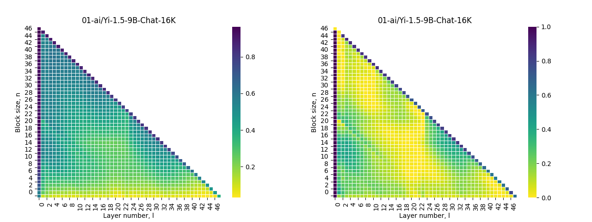</p>

#### Linear Approximation Last Token 

Figure 1: Linear Approximation Last Token. Figure 2: Linear Approximation Last Token  Normalised


<p align="center">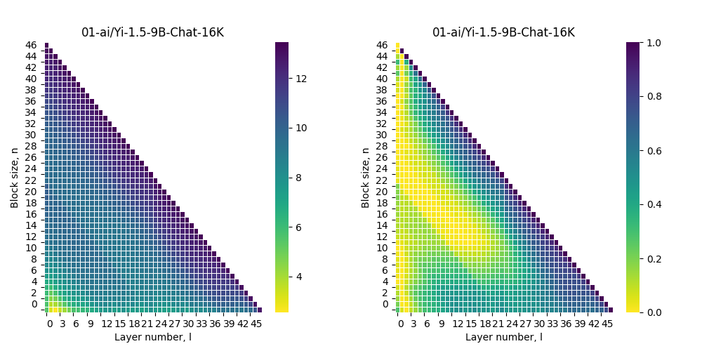</p>

#### Angular Distance Last Token 

Figure 1: Angular Distance Last Token. Figure 2: Angular Distance Last Token  Normalised


<p align="center">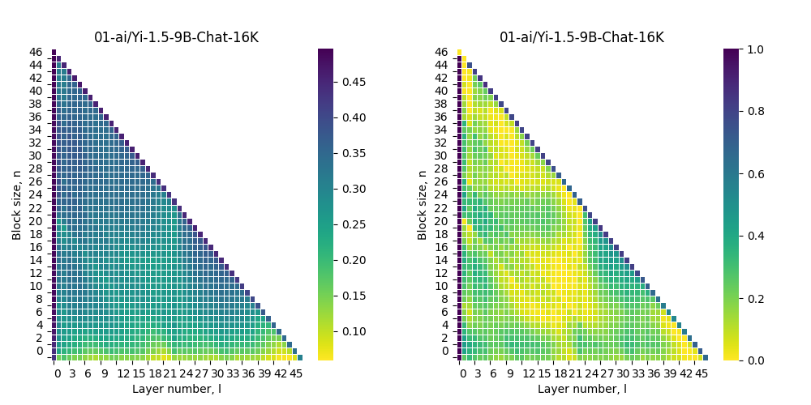</p>


## Citing:

If you use Short Transformers in your research, please cite with the following BibText

```bibtext
@misc{russak2024shorttransformers,
    title  = {ShortTransformers, optimal layer pruning tools},
    author = {Melisa Russak},
    url    = {https://github.com/melisa/short-transformers},
    year   = {2024}
}
```
```bibtext
@misc{gromov2024unreasonable,
      title={The Unreasonable Ineffectiveness of the Deeper Layers}, 
      author={Andrey Gromov and Kushal Tirumala and Hassan Shapourian and Paolo Glorioso and Daniel A. Roberts},
      year={2024},
      eprint={2403.17887},
      archivePrefix={arXiv},
      primaryClass={cs.CL}
}
```
```bibtext
@misc{razzhigaev2024transformer,
      title={Your Transformer is Secretly Linear}, 
      author={Anton Razzhigaev and Matvey Mikhalchuk and Elizaveta Goncharova and Nikolai Gerasimenko and Ivan Oseledets and Denis Dimitrov and Andrey Kuznetsov},
      year={2024},
      eprint={2405.12250},
      archivePrefix={arXiv},
      primaryClass={cs.LG}
}
```
```bibtext
@misc{men2024shortgpt,
      title={ShortGPT: Layers in Large Language Models are More Redundant Than You Expect}, 
      author={Xin Men and Mingyu Xu and Qingyu Zhang and Bingning Wang and Hongyu Lin and Yaojie Lu and Xianpei Han and Weipeng Chen},
      year={2024},
      eprint={2403.03853},
      archivePrefix={arXiv},
      primaryClass={cs.CL}
}
```
```bibtext
@misc{samragh2023weight,
      title={Weight subcloning: direct initialization of transformers using larger pretrained ones}, 
      author={Mohammad Samragh and Mehrdad Farajtabar and Sachin Mehta and Raviteja Vemulapalli and Fartash Faghri and Devang Naik and Oncel Tuzel and Mohammad Rastegari},
      year={2023},
      eprint={2312.09299},
      archivePrefix={arXiv},
      primaryClass={cs.LG}
}
```
