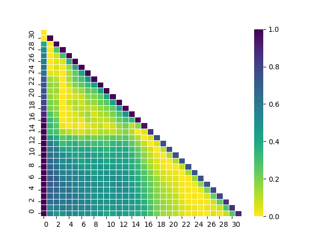

# :scissors: Short Transformers

- Pytorch implementation of layer pruning proposed in [The Unreasonable Ineffectiveness of the Deeper Layers](https://arxiv.org/pdf/2403.17887.pdf).
- The repository reproduces and extends original methods by offering different layer pruning criteria.

<p align="center">

</p>

[](https://pypi.org/project/short-transformers/)
[](https://github.com/ambv/black)

## Installation:
```sh
pip install short-transformers
```

## Quickstart:
```python
from short-transformers import ShortTransformer

# load from path/hf_hub
model = ShortTransformer.from_pretrained(model_name)

# or use hf model
model = ShortTransformer.from_model(hf_model)

# remove n layers, use hf dataset to find the optimal cut
short_model = model.remove_layers(n=5, dataset) # (n, dataset, key, limit, batch_size, return_outputs, distance)

# continue training to heal after the cut
# ...

# save as hf model
short_mdoel.save_pretrained(output_path)
```

## Supported pruning methods:
- based on layer input/output distances:
    - angular distance of the last token (original)
    - averaged angular distances of all tokens

- based on layer linear replacement loss

## Checkpoints:
Collection of pruned and finetuned models:

## Citing

If you use Short Transformers in your research, please cite with the following BibText

```bibtext
@misc{russak2024shorttransformers,
    title  = {ShortTransformers, optimal layer pruning tools},
    author = {Melisa Russak},
    url    = {https://github.com/melisa/short-transformers},
    year   = {2024}
}
```
```bibtext
@misc{gromov2024unreasonable,
      title={The Unreasonable Ineffectiveness of the Deeper Layers}, 
      author={Andrey Gromov and Kushal Tirumala and Hassan Shapourian and Paolo Glorioso and Daniel A. Roberts},
      year={2024},
      eprint={2403.17887},
      archivePrefix={arXiv},
      primaryClass={cs.CL}
}
```