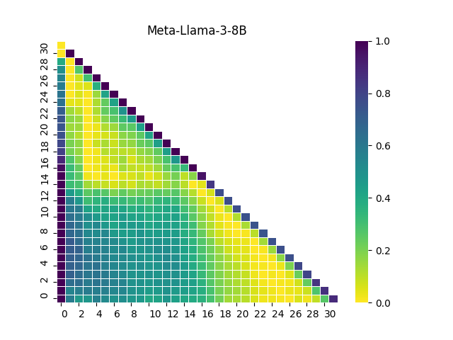

# :scissors: Short Transformers

- Pytorch implementation of layer pruning proposed in [The Unreasonable Ineffectiveness of the Deeper Layers](https://arxiv.org/pdf/2403.17887.pdf).
- The repository reproduces and extends original methods by offering different layer pruning criteria.

<p align="center">

</p>

[](https://pypi.org/project/short-transformers/)
[](https://github.com/astral-sh/ruff)

## Installation:
```sh
pip install short-transformers
```

Required additional dependencies: `transformers`, `datasets`.

## Quickstart:
```python
from short_transformers import ShortTransformer

# load from path/hf_hub
model = ShortTransformer.from_pretrained(model_name)

# or use hf model
model = ShortTransformer.from_model(hf_model)

# remove n layers, use hf dataset to find the optimal cut
short_model = model.remove_layers(block_size=5, dataset=dataset, limit=1000)

# continue training to heal after the cut
# ...

# save as hf model
short_mdoel.save_pretrained(output_path)
```
Example log output:
```sh
[2024-05-04 18:39:03] [short-transformers] Running inference on 1000 samples.
1000it [00:06, ?it/s]
[2024-05-04 18:39:09] [short-transformers] Inference results saved to `model.memory`.
[2024-05-04 18:39:09] [short-transformers] Choosing optimal 5-layers block to prune.
[2024-05-04 18:39:09] [short-transformers] Best 5-layers block to prune starts at layer: 23.
[2024-05-04 18:39:09] [short-transformers] Removing layers: [23, 24, 25, 26, 27]
[2024-05-04 18:39:09] [short-transformers] Changing model config to reflect changes:
        config.num_hidden_layers: 32 -> 27
        config._name_or_path: meta-llama/Meta-Llama-3-8B -> meta-llama/Meta-Llama-3-8B-27L
[2024-05-04 18:39:09] [short-transformers] Cleaning `model.memory`.
```

Both `short_model` and the saved model are fully compatible with transformers. See `examples/basic.py` for a complete working example.

## Pruning in steps:

Pruning can composed step-by-step and customized:

1. Analyze model layers:
```python
from datasets import load_dataset
from short_transformers import ShortTransformer
from short_transformers.graph import draw_diagram

# load from path/hf_hub
model_name = "meta-llama/Meta-Llama-3-8B"

model = ShortTransformer.from_pretrained(model_name, device_map="auto")

dataset = load_dataset("allenai/c4", "en", split="validation", streaming=True)

# run inderence on a subset of the datsets
model.analyse_layers(
    dataset=dataset,
    key="text",
    limit=100,
    max_length=1000,
)

# after this step, results will be saved to model.memory, which can be saved
model.save_memory("memory.npz")

# and visualized as seaborh graph (see examples in the README.md)
draw_diagram("memory.npz", "memory.png")
```

Example output:
<p align="center">

</p>

2. Find optimal block size and start_layer:
```python
# finding optimial block of size 'num' to prune
start_layer = model.get_optimal_cut(block_size=5)

# evaluating all possibe block sizes to prune,
# for each block returns score 0-1
# which is averaged over samples distance between input and output to/from a block
block_score = model.get_block_score_stats(return_md=True, threshold=0.3)
```

Example output:

| Block_size | Removed_layers | Score (avg dist)|
| -------- | ------- | -------- |
| 1 | 25-25 | 0.123|
| 2 | 24-25 | 0.155|
| 3 | 25-27 | 0.181|
| 4 | 24-27 | 0.204|
| 5 | 23-27 | 0.226|
| 6 | 22-27 | 0.248|
| 7 | 22-28 | 0.268|
| 8 | 20-27 | 0.291|


3. Pruning layers:
```python
# pruning 5-layers block
# this will also clean the `model.memory``
model.cut(start_layer=start_layer, block_size=5)

# or clean the model memory manually
model.clean_memory()

# save the pruned model
model.save_pretrained("model_path")
```

See `example/prune_in_steps.py` for a complete working example.


## Supported pruning methods:
- based on layer input/output distances:
    - angular distance of the last token (original)
    - averaged angular distances of all tokens

- todo: based on layer linear replacement trining loss

## Citing

If you use Short Transformers in your research, please cite with the following BibText

```bibtext
@misc{russak2024shorttransformers,
    title  = {ShortTransformers, optimal layer pruning tools},
    author = {Melisa Russak},
    url    = {https://github.com/melisa/short-transformers},
    year   = {2024}
}
```
```bibtext
@misc{gromov2024unreasonable,
      title={The Unreasonable Ineffectiveness of the Deeper Layers}, 
      author={Andrey Gromov and Kushal Tirumala and Hassan Shapourian and Paolo Glorioso and Daniel A. Roberts},
      year={2024},
      eprint={2403.17887},
      archivePrefix={arXiv},
      primaryClass={cs.CL}
}
```